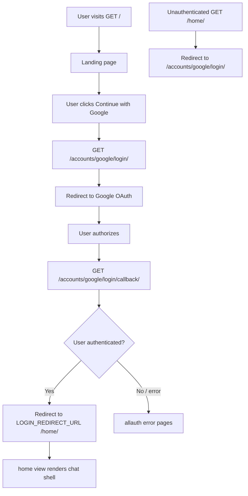

# Chatxii Backend Documentation

Reverse-engineered from the Django codebase. All behavior below is derived from actual code in `chat/`. Nothing is invented.

---

## 1. Project Structure

### 1.1 Django project

| Item | Value |
|------|-------|
| Project package | `chat/` |
| Settings | `chat/settings.py` |
| Root URLconf | `chat/urls.py` |
| Database | SQLite (`db.sqlite3`) |
| Auth | django-allauth + Google OAuth |
| Django version | 5.2.15 |

### 1.2 Installed apps

| App | Purpose |
|-----|---------|
| `django.contrib.*` | Admin, auth, sessions, messages, staticfiles, sites |
| `allauth` | Account + social auth |
| `allauth.account` | Email/password account flows (available but not used by landing UI) |
| `allauth.socialaccount` | Social login infrastructure |
| `allauth.socialaccount.providers.google` | Google OAuth |
| `home` | Landing page + main chat shell page |
| `userProfile` | Custom display username (`Profile` model) |
| `relationship` | Friends, requests, blocks |
| `messanging` | Direct messages (note: app name is misspelled) |

### 1.3 URL routing (how everything connects)

```
chat/urls.py
├── admin/                          → Django admin
├── accounts/                       → allauth (login, logout, Google OAuth, etc.)
├── messanging/                     → messanging/urls.py
├── relationship/                   → relationship/urls.py
├── profile/                        → userProfile/urls.py
└── ""                              → home/urls.py
```

```
home/urls.py
├── ""        → views.landing       (public)
└── home/     → views.home          (@login_required)

relationship/urls.py
├── search/                         → views.search
├── search/<search_query>/          → views.search
├── friends/                        → views.friendList
├── blocks/                         → views.blockList
├── requests/sent/                  → views.requestSent
├── requests/received/              → views.requestRecv
├── block/<user>/                   → views.blockUser
├── unblock/<user>/                 → views.unblockUser
├── request/<user>/                 → views.request
├── request/cancel/<user>/          → views.cancelRequest
├── request/accept/<user>/          → views.accept
├── request/reject/<user>/          → views.reject
└── unfriend/<user>/                → views.unfriend

messanging/urls.py
├── send/<receiverUsername>/        → views.sendChat
└── recv/<receiverUsername>/        → views.loadChat

userProfile/urls.py
└── changeusername/<username>       → views.changeUsername   (NO trailing slash)
```

**`<user>` / `<receiverUsername>` in URL paths:** resolved via `Profile.objects.filter(username=user).first()` — these parameters expect **`Profile.username`**, not `User.username`.

### 1.4 Models

| Model | App | Fields |
|-------|-----|--------|
| `Profile` | userProfile | `user` (OneToOne → User), `username` (TextField, max 16) |
| `Relationship` | relationship | `actor` (FK → User), `acted` (FK → User), `status` (Char, 1 char) |
| `Messages` | messanging | `sender` (FK → User), `receiver` (FK → User), `content` (TextField, max 4096) |
| *(none)* | home | Empty — no models |

**Relationship status values:**

| Code | Label | Meaning |
|------|-------|---------|
| `F` | Friend | Users are friends |
| `R` | Request | Pending friend request |
| `B` | Block | Block relationship |

**No timestamps** on `Messages`. **No unique constraint** on `Relationship` (duplicates possible if logic bypassed). **No `related_name`** on `Profile.user` (reverse accessor defaults to `user.profile`).

### 1.5 Views

| App | View | Auth protection | Response type |
|-----|------|-----------------|---------------|
| home | `landing` | None | HTML |
| home | `home` | `@login_required` | HTML |
| relationship | `friendList`, `blockList`, `requestSent`, `requestRecv`, `search` | **None** | JSON |
| relationship | `blockUser`, `unblockUser`, `request`, `cancelRequest`, `accept`, `reject`, `unfriend` | **None** | plain text |
| messanging | `loadChat`, `sendChat` | **None** | JSON / plain text |
| userProfile | `changeUsername` | **None** | plain text |

### 1.6 Templates

| Template | Used by | Purpose |
|----------|---------|---------|
| `home/templates/landing/index.html` | `landing` | Public login page with Google button |
| `home/templates/home/index.html` | `home` | Main chat UI shell (3-column layout) |

### 1.7 Static files

| File | Purpose |
|------|---------|
| `home/static/home/css/chat.css` | Styles for chat shell |
| `home/static/home/js/chat.js` | Client-side API integration (existing; not part of backend spec) |

Landing page styles are **inline** in `landing/index.html`.

---

## 2. Authentication Flow

### 2.1 Configuration (`settings.py`)

```python
AUTHENTICATION_BACKENDS = (
    "django.contrib.auth.backends.ModelBackend",
    "allauth.account.auth_backends.AuthenticationBackend",
)
LOGIN_REDIRECT_URL = "/home/"
LOGOUT_REDIRECT_URL = "/"
SOCIALACCOUNT_LOGIN_ON_GET = True
SITE_ID = 1
SOCIALACCOUNT_PROVIDERS = { "google": { "APP": { client_id, secret from env } } }
```

Environment variables: `SECRET_KEY`, `GOOGLE_CLIENT_ID`, `GOOGLE_CLIENT_SECRET` (via `.env` + `python-dotenv`).

### 2.2 Pages and routes

| Purpose | URL | Mechanism |
|---------|-----|-----------|
| Landing / entry | `GET /` | `landing` view — public |
| Login (Google) | `GET /accounts/google/login/` | allauth — `SOCIALACCOUNT_LOGIN_ON_GET=True` starts OAuth on GET |
| OAuth callback | `GET /accounts/google/login/callback/` | allauth completes login |
| Logout | `GET /accounts/logout/` | allauth — linked from chat shell |
| Main app | `GET /home/` | `@login_required(login_url="/accounts/google/login/")` |
| Admin | `/admin/` | Django admin (separate auth) |

allauth also registers standard account URLs (`/accounts/login/`, `/accounts/signup/`, password reset, etc.) but the **only login UI in templates** is the Google button on `/`.

### 2.3 Google login flow



### 2.4 Protected vs unprotected routes

| Route | Protected? |
|-------|------------|
| `GET /` | No |
| `GET /home/` | **Yes** — `@login_required` |
| `GET /accounts/logout/` | No (logs out if session exists) |
| All `/relationship/*` | **No** — uses `request.user` without guard |
| All `/messanging/*` | **No** |
| `POST /profile/changeusername/<username>` | **No** |
| `/admin/*` | Django admin session |

**Implication:** API endpoints assume an authenticated session but do not enforce it. Anonymous requests use `AnonymousUser` and may error or behave unexpectedly.

### 2.5 Profile creation on login

There is **no signal** or post-login hook that creates a `Profile`. Profiles are created **lazily** inside `relationship.views.search` when a user appears in search results and has no profile:

```python
Profile.objects.create(user=target_user, username=target_user.username[:16])
```

A newly logged-in user may have **no Profile** until search runs or they call `changeUsername` (which updates, not creates).

---

## 3. Profile System

### 3.1 Model

```python
class Profile(models.Model):
    user = models.OneToOneField(User, on_delete=models.CASCADE)
    username = models.TextField(max_length=16)
```

### 3.2 Two username fields

| Field | Source | Used for |
|-------|--------|----------|
| `User.username` | Django auth / Google account | Message JSON keys; friend/block/request **list** endpoints; `data-auth-username` in template |
| `Profile.username` | User-chosen display name (max 16) | URL path params for all relationship + messaging actions; search results; profile panel display |

### 3.3 Findings

| Question | Answer |
|----------|--------|
| Is `User.username` used? | **Yes** — list endpoints and message payloads |
| Is `Profile.username` used? | **Yes** — action URLs, search display, profile UI |
| Which should be displayed? | **Ambiguous in backend** — template shows `Profile.username` if profile exists, else `User.username`. Search shows `Profile.username`. Friend/request/block lists return `User.username`. |
| Which should be searchable? | Search queries **both**: `User.username`, `User.first_name`, `User.last_name`, `Profile.username` |
| Which should be used in chat? | **URLs use `Profile.username`**; **message ownership keys use `User.username`** |

### 3.4 Critical inconsistency

If a user changes `Profile.username` via `/profile/changeusername/<username>`:

- Search and action URLs use the **new** `Profile.username`
- `/relationship/friends/` (and sent/received/block lists) still return **`User.username`**
- Clicking a friend from the friends list passes `User.username` to messaging URLs → **`Profile` lookup fails** → `"user not found"` (404)

The chat shell template exposes both:

```html
<p id="currentUsername" data-auth-username="{{ user.username }}">
    {{ user.profile.username }}{{ user.username }}
</p>
```

Message bubble alignment compares message keys to **`User.username`** (`data-auth-username`), not `Profile.username`.

---

## 4. Relationship System

### 4.1 Semantics of `actor` and `acted`

| Concept | `actor` | `acted` |
|---------|---------|---------|
| **Role** | Initiator / source of action | Target / recipient of action |
| Friend request | Sender of request | Receiver of request |
| Block | User who blocked | User who was blocked |
| Friend (after accept) | Original request sender | User who accepted |

Direction **matters** for requests and blocks. Friend rows are stored with the same direction as the accepted request.

### 4.2 Status reference

| Status | Code | Typical row |
|--------|------|-------------|
| Friend | `F` | `actor` ↔ `acted` friends |
| Request | `R` | `actor` sent request **to** `acted` |
| Block | `B` | `actor` blocked `acted` |

### 4.3 Derived status strings (`search` only)

`_relationship_status(request_user, target_user)` returns:

| String | Condition |
|--------|-----------|
| `"blocked"` | Block row in **either** direction |
| `"friend"` | Friend row in **either** direction |
| `"request_sent"` | `actor=me, acted=them, status=R` |
| `"request_received"` | `actor=them, acted=me, status=R` |
| `"none"` | No matching row |

### 4.4 Worked examples

Assume:

- John → `User` id=1, `User.username="john@gmail.com"`, `Profile.username="john"`
- Bob → `User` id=2, `User.username="bob@gmail.com"`, `Profile.username="bob"`

#### Example A — John sends friend request to Bob

**Request:** John authenticated, `GET /relationship/request/bob/`

**Database row created:**

| actor | acted | status |
|-------|-------|--------|
| John (id=1) | Bob (id=2) | `R` |

**Response:** `"success"` (plain text)

If relationship already exists (friend/request/block either direction): still `"success"`, **no new row**.

---

#### Example B — Bob accepts John's request

**Request:** Bob authenticated, `GET /relationship/request/accept/john/`

**Steps:**
1. Delete row where `actor=John, acted=Bob, status=R`
2. Create row where `actor=John, acted=Bob, status=F`

**Final row:**

| actor | acted | status |
|-------|-------|--------|
| John | Bob | `F` |

**Response:** `"success"` or `"failed"` if no pending request from John

---

#### Example C — John blocks Bob (Bob had not blocked John)

**Request:** John authenticated, `GET /relationship/block/bob/`

**Steps:**
1. Delete **all** rows between John and Bob (friend, request, block)
2. No existing `actor=Bob, acted=John, status=B` → not mutual
3. Create one row

**Final row:**

| actor | acted | status |
|-------|-------|--------|
| John | Bob | `B` |

**Response:** `"success"`

---

#### Example D — John blocks Bob (Bob already blocked John)

Before block, row exists: `actor=Bob, acted=John, status=B`

**Steps:**
1. Delete all rows between them (including Bob's block row)
2. Detect mutual scenario → create **two** rows

**Final rows:**

| actor | acted | status |
|-------|-------|--------|
| John | Bob | `B` |
| Bob | John | `B` |

---

#### Example E — John unblocks Bob

**Request:** John authenticated, `GET /relationship/unblock/bob/`

**Deletes:** `actor=John, acted=Bob, status=B` only

If mutual block (two rows), **only John's row is removed**; Bob→John block may remain.

**Response:** `"succss"` (typo in code — not `"success"`)

---

#### Example F — Bob rejects John's request

**Request:** Bob authenticated, `GET /relationship/request/reject/john/`

**Deletes:** `actor=John, acted=Bob, status=R`

**Response:** `"success"` or `"failed"`

---

#### Example G — John cancels sent request

**Request:** John authenticated, `GET /relationship/request/cancel/bob/`

**Deletes:** `actor=John, acted=Bob, status=R`

**Response:** `"success"` if deleted; **no explicit response** if not found (implicit empty 200)

---

#### Example H — John unfriends Bob

**Request:** John authenticated, `GET /relationship/unfriend/bob/`

**Deletes:** friend row in either direction

**Response:** `"success"` or `"failed"`

---

### 4.5 List endpoint username source

| Endpoint | Returns | Username field |
|----------|---------|----------------|
| `GET /relationship/friends/` | JSON array of strings | **`User.username`** of the other party |
| `GET /relationship/blocks/` | JSON array | **`User.username`** of `acted` (users you blocked) |
| `GET /relationship/requests/sent/` | JSON array | **`User.username`** of `acted` |
| `GET /relationship/requests/received/` | JSON array | **`User.username`** of `actor` |

**Note:** Blocks list only includes users **you** blocked (`actor=request.user`), not users who blocked you.

---

## 5. Chat System

### 5.1 Messages model

```python
class Messages(models.Model):
    sender = ForeignKey(User, related_name="sent")
    receiver = ForeignKey(User, related_name="recv")
    content = TextField(max_length=4096)
```

No `created_at`, no ordering metadata.

### 5.2 Load messages

**Endpoint:** `GET /messanging/recv/<Profile.username>/`

**Logic:**
1. Resolve receiver via `Profile.username`
2. If not found → `404` `"user not found"`
3. Query: all messages where `(sender=me AND receiver=them) OR (sender=them AND receiver=me)`
4. **No friend check**
5. **No login guard**
6. **No `.order_by()`** — order is undefined (typically PK insertion order)

**Response:** JSON array of single-key objects:

```json
[
  {"john@gmail.com": "Hello"},
  {"bob@gmail.com": "Hi there"}
]
```

Keys are **`User.username`** of the sender, not `Profile.username`.

### 5.3 Send message

**Endpoint:** `POST /messanging/send/<Profile.username>/`

**Body:** JSON `{"content": "message text"}`

**Logic:**
1. Resolve receiver via `Profile.username` → 404 if missing
2. If **any** block between users (either direction) → `"failed"`
3. Else if **friend** (either direction, status `F`) → create message, `"success"`
4. Else → `"failed"`

**No CSRF exemption** — POST requires valid CSRF token (Django default).

**No explicit `@login_required`** — relies on session.

### 5.4 Message ownership (for frontend)

| Question | Answer |
|----------|--------|
| Who is sender? | `Messages.sender` → `User` |
| How to detect "my message"? | Compare object key to **`request.user.username`** (`User.username`) |
| How to detect "their message"? | Key ≠ current user's `User.username` |
| Do **not** compare to `Profile.username` for bubble alignment | Message keys never use `Profile.username` |

---

## 6. Complete API Documentation

Unless noted, endpoints accept **any HTTP method** (views do not restrict method). Authenticated session is **assumed** but **not enforced**.

Content-Type: JSON responses use `application/json`. Plain text responses are raw strings in body.

---

### 6.1 Home

#### `GET /`

| | |
|--|--|
| **Auth** | None |
| **Response** | HTML landing page |

#### `GET /home/`

| | |
|--|--|
| **Auth** | Required — redirects to `/accounts/google/login/` |
| **Response** | HTML chat shell |

---

### 6.2 Auth (allauth)

#### `GET /accounts/google/login/`

Starts Google OAuth (immediate redirect due to `SOCIALACCOUNT_LOGIN_ON_GET`).

#### `GET /accounts/google/login/callback/`

OAuth callback; on success redirects to `/home/`.

#### `GET /accounts/logout/`

Logs out; redirects to `/` (`LOGOUT_REDIRECT_URL`).

Other allauth routes exist (signup, password reset, email confirm, etc.) but are not linked from app templates.

---

### 6.3 Profile

#### `POST /profile/changeusername/<username>`

| | |
|--|--|
| **Auth** | Not enforced |
| **Parameters** | `username` in URL path (new desired `Profile.username`) |
| **Body** | None required |
| **CSRF** | Required for POST |

**Responses:**

| Status | Body | Meaning |
|--------|------|---------|
| 200 | `"success"` | Updated current user's profile username |
| 400 | `"username taken"` | Another profile already has that username |
| 200 | `"success"` | Also returned if current user has **no Profile row** (update affects 0 rows) |

**Note:** URL has **no trailing slash**.

---

### 6.4 Relationship — read endpoints

#### `GET /relationship/friends/`

**Response:** JSON array of **`User.username`** strings.

```json
["john@gmail.com", "alex@gmail.com"]
```

#### `GET /relationship/blocks/`

**Response:** JSON array of **`User.username`** for users you blocked.

```json
["spammer@gmail.com"]
```

#### `GET /relationship/requests/sent/`

**Response:** JSON array of **`User.username`** you sent requests to.

#### `GET /relationship/requests/received/`

**Response:** JSON array of **`User.username`** who sent you requests.

#### `GET /relationship/search/`

#### `GET /relationship/search/<search_query>/`

| | |
|--|--|
| **Parameters** | Optional `search_query` in path; empty string lists all other users |
| **Auth** | Not enforced |

**Response:** JSON array of objects:

```json
[
  {"username": "john", "status": "none"},
  {"username": "alex", "status": "friend"},
  {"username": "bob", "status": "request_received"}
]
```

- `username` = **`Profile.username`** (auto-creates profile if missing)
- `status` = one of: `"friend"`, `"blocked"`, `"request_sent"`, `"request_received"`, `"none"`

Search matches (case-insensitive): `User.username`, `User.first_name`, `User.last_name`, `Profile.username`.

---

### 6.5 Relationship — action endpoints

All action URLs use `<user>` = **`Profile.username`**.

| URL | Typical method used by client | Success body | Failure body |
|-----|------------------------------|--------------|--------------|
| `/relationship/request/<user>/` | GET | `"success"` | `"failed"` (profile not found) |
| `/relationship/request/cancel/<user>/` | GET | `"success"` | `"failed"` or empty 200 |
| `/relationship/request/accept/<user>/` | GET | `"success"` | `"failed"` |
| `/relationship/request/reject/<user>/` | GET | `"success"` | `"failed"` |
| `/relationship/block/<user>/` | GET | `"success"` | `"failed"` |
| `/relationship/unblock/<user>/` | GET | `"succss"` | `"failed"` |
| `/relationship/unfriend/<user>/` | GET | `"success"` | `"failed"` |

**`request` idempotency:** Returns `"success"` without change if any friend/request/block already exists between users.

**No CSRF** required (client uses GET via `fetch` without method override).

---

### 6.6 Messaging

#### `GET /messanging/recv/<receiverUsername>/`

| | |
|--|--|
| **Parameters** | `receiverUsername` = **`Profile.username`** |
| **Response 200** | `[{ "<User.username>": "<content>" }, ...]` |
| **Response 404** | `"user not found"` |

#### `POST /messanging/send/<receiverUsername>/`

| | |
|--|--|
| **Parameters** | `receiverUsername` = **`Profile.username`** |
| **Body** | `{"content": "string"}` (max 4096 chars) |
| **CSRF** | Required |
| **Response 200** | `"success"` or `"failed"` |
| **Response 404** | `"user not found"` |

**Send fails when:** not friends, or blocked either direction, or invalid JSON body (would raise 500).

---

## 7. User States

States below match `_relationship_status()` and list/search behavior.

### 7.1 `none`

| Aspect | Behavior |
|--------|----------|
| **Allowed backend actions** | Send friend request (`/relationship/request/<Profile.username>/`) |
| **Chat load** | Allowed (no restriction) |
| **Chat send** | Denied (`"failed"`) |
| **Suggested UI actions** | "Send Friend Request" |
| **Message input** | Hidden / disabled |

### 7.2 `request_sent`

| Aspect | Behavior |
|--------|----------|
| **DB row** | `actor=me, acted=them, status=R` |
| **Allowed actions** | Cancel request |
| **Chat load** | Allowed |
| **Chat send** | Denied |
| **Suggested UI** | "Cancel Request" |
| **Message input** | Hidden |

### 7.3 `request_received`

| Aspect | Behavior |
|--------|----------|
| **DB row** | `actor=them, acted=me, status=R` |
| **Allowed actions** | Accept, Reject |
| **Chat load** | Allowed |
| **Chat send** | Denied |
| **Suggested UI** | "Accept Request", "Reject Request" |
| **Message input** | Hidden |

### 7.4 `friend`

| Aspect | Behavior |
|--------|----------|
| **DB row** | `status=F` (either direction) |
| **Allowed actions** | Send messages, Unfriend (backend only — no UI in current shell) |
| **Chat load** | Allowed |
| **Chat send** | Allowed (unless blocked — block takes precedence in send check order) |
| **Suggested UI** | Message input + Send button |
| **Message input** | Visible |

### 7.5 `blocked`

| Aspect | Behavior |
|--------|----------|
| **Detection** | Block in **either** direction |
| **Allowed actions** | Unblock (removes **your** block row only) |
| **Chat load** | Allowed |
| **Chat send** | Denied |
| **Suggested UI** | "Unblock User" notice |
| **Message input** | Hidden |

**Note:** Backend exposes `/relationship/block/<user>/` but current chat shell JS does **not** call it.

---

## 8. Frontend Requirements Derived from Backend

These are **requirements**, not implementation. All map to verified backend behavior.

### 8.1 Required UI components

| Component | Backend source |
|-----------|----------------|
| Google login button | Landing → `/accounts/google/login/` |
| Logout link | `/accounts/logout/` |
| User search input | `/relationship/search/` |
| Search results list | Search JSON with `username` + `status` |
| Friends list | `/relationship/friends/` |
| Requests received list | `/relationship/requests/received/` |
| Requests sent list | `/relationship/requests/sent/` |
| Blocked users list | `/relationship/blocks/` |
| Chat header | Selected user's display identifier |
| Message list | `/messanging/recv/<Profile.username>/` |
| Message input + send | POST `/messanging/send/<Profile.username>/` |
| Relationship action area | State-dependent buttons (see §7) |
| Profile panel | Show username, change form, logout |
| CSRF handling | Required for POST send + change username |

### 8.2 Required lists

All lists are JSON string arrays except search (objects with `username`, `status`).

**Critical:** Friend/request/block lists return **`User.username`**; search and actions use **`Profile.username`**. Frontend must resolve or backend must be fixed — today they diverge after a profile rename.

### 8.3 Required actions → API mapping

| User action | API call |
|-------------|----------|
| Search | `GET /relationship/search/` or `GET /relationship/search/<query>/` |
| Send friend request | `GET /relationship/request/<Profile.username>/` |
| Cancel request | `GET /relationship/request/cancel/<Profile.username>/` |
| Accept request | `GET /relationship/request/accept/<Profile.username>/` |
| Reject request | `GET /relationship/request/reject/<Profile.username>/` |
| Block user | `GET /relationship/block/<Profile.username>/` |
| Unblock user | `GET /relationship/unblock/<Profile.username>/` |
| Unfriend | `GET /relationship/unfriend/<Profile.username>/` |
| Load messages | `GET /messanging/recv/<Profile.username>/` |
| Send message | `POST /messanging/send/<Profile.username>/` + JSON body + CSRF |
| Change username | `POST /profile/changeusername/<new_name>` + CSRF |

### 8.4 Required buttons (by state)

| State | Buttons |
|-------|---------|
| `none` | Send Friend Request |
| `request_sent` | Cancel Request |
| `request_received` | Accept Request, Reject Request |
| `friend` | Send (message), optionally Unfriend |
| `blocked` | Unblock User |

### 8.5 Empty states

| Location | When |
|----------|------|
| Friends list | Empty array → "None" |
| Requests sent/received | Empty array |
| Blocked list | Empty array |
| Search | No results / all filtered |
| Chat | No user selected; no messages yet |
| Send failure | Silent in current JS — should surface `"failed"` |

### 8.6 Message rendering rule

For each message object `{ "<key>": "<content>" }`:

```
if key === currentUser.user.username → render as "my" message
else → render as "their" message
```

Use **`User.username`**, not `Profile.username`, for alignment.

---

## PHASE 2 — Validation / Bug Report

### Critical

| ID | Issue | Location |
|----|-------|----------|
| C1 | **No login protection on API views** — all relationship, messaging, profile endpoints accessible without `@login_required` | All views except `home` |
| C2 | **Username split** — lists return `User.username`, actions/search use `Profile.username` | `relationship/views.py` list vs action views |
| C3 | **loadChat has no authorization** — any session can load messages between any two users if they know `Profile.username` | `messanging/views.py:loadChat` |
| C4 | **loadChat has no friendship check** — messages readable even when not friends | `messanging/views.py:loadChat` |

### High

| ID | Issue | Location |
|----|-------|----------|
| H1 | **Duplicate `unfriend` function** — defined twice; second definition wins | `relationship/views.py:164-186` |
| H2 | **`changeUsername` succeeds when user has no Profile** — update 0 rows, returns success | `userProfile/views.py` |
| H3 | **Message order undefined** — no `order_by` on messages | `messanging/views.py:loadChat` |
| H4 | **After profile rename, friends list breaks chat** — list IDs don't match messaging URL lookup | Cross-app |
| H5 | **Anonymous POST send** — would error on `json.loads(request.body)` or attribute errors | `messanging/views.py:sendChat` |

### Medium

| ID | Issue | Location |
|----|-------|----------|
| M1 | **Typo in unblock response** — `"succss"` not `"success"` | `relationship/views.py:61` |
| M2 | **`cancelRequest` missing failure response** — falls through with empty 200 | `relationship/views.py:95-101` |
| M3 | **Missing trailing slash** on profile URL — inconsistent with other routes | `userProfile/urls.py` |
| M4 | **N+1 queries in search** — per-user `Profile.objects.filter` in loop | `relationship/views.py:147-153` |
| M5 | **N+1 in list views** — acceptable at small scale; no `select_related` | relationship list views |
| M6 | **`request()` returns success when blocked** — cannot re-request; misleading success | `relationship/views.py:68-69` |
| M7 | **No unique constraint on Relationship** — duplicate rows possible | `relationship/models.py` |
| M8 | **Block list omits users who blocked you** — status shows `blocked` in search but user absent from block list | blockList vs `_relationship_status` |

### Low / dead code

| ID | Issue | Location |
|----|-------|----------|
| L1 | **Empty models/admin/tests** in all apps | Multiple |
| L2 | **`unfriend` endpoint unused** by current frontend | `relationship/urls.py` |
| L3 | **`blockUser` endpoint unused** by current frontend | `relationship/urls.py` |
| L4 | **App typo `messanging`** | project-wide |
| L5 | **Search "Open Chat" for blocked users** in existing JS — dead branch (blocked users filtered from search in friends filter, but status blocked can't click open chat from search filter logic) | `chat.js` — reference only |

### Conflicting logic summary

1. **Display identity vs action identity:** Profile for URLs, User for lists and message keys.
2. **Block semantics:** Search treats either-direction block as `blocked`; block list only shows outgoing blocks.
3. **Accept stores friend row in request direction** (`actor=original sender`), but friend check accepts either direction.

---

## PHASE 3 — Frontend Specification

Specification only. **No code.** Must match backend exactly.

### 3.1 Architecture

Single-page chat shell at `/home/` (server-rendered HTML skeleton). All dynamic data via fetch to JSON/text endpoints. Session cookie auth. CSRF token from cookie for POST requests.

### 3.2 Layout (three columns)

1. **People panel** — search, friends, requests received, requests sent, blocked
2. **Chat panel** — header, messages, footer (actions or message input)
3. **Profile panel** — current display username, change username form, logout

### 3.3 Identifier strategy (must handle backend quirk)

The backend uses **two usernames**. Frontend spec must:

| Context | Use |
|---------|-----|
| Display in search results | `Profile.username` from search API |
| URL path for all actions + messaging | `Profile.username` |
| Display in friend/request/block lists | Currently backend sends `User.username` — **frontend cannot use these directly in action URLs** unless they equal `Profile.username` |
| Message bubble alignment | `User.username` of logged-in user |
| Profile panel display | Prefer `Profile.username`, fallback `User.username` |

**Open question for product/backend fix:** Should lists be updated to return `Profile.username`? Until then, frontend needs a mapping layer or lists will break after rename. **Do not guess** — escalate to backend change or fetch profile mapping.

### 3.4 Initial load sequence

1. User arrives at `/home/` (already authenticated)
2. Parallel fetch:
   - `GET /relationship/friends/`
   - `GET /relationship/requests/received/`
   - `GET /relationship/requests/sent/`
   - `GET /relationship/blocks/`
3. Render four lists; empty → "None"
4. Chat area shows "Select a conversation"

Server template provides `data-auth-username="{{ user.username }}"` for message alignment.

### 3.5 Search behavior

| Event | API |
|-------|-----|
| Focus with empty query | `GET /relationship/search/` |
| Type query | `GET /relationship/search/<encoded_query>/` |
| Debouncing | Recommended (not backend requirement) |

Render each result: `username` + status label.

**Filter rule (existing client behavior):** Exclude `status === "friend"` from search results display.

| status | Primary button |
|--------|----------------|
| `none` | Send Friend Request |
| `request_sent` | Cancel Request |
| `request_received` | Accept Request |
| `friend` | (excluded from search list) |
| `blocked` | Not in separate branch — treat per search rendering |

On action success: refresh all four lists + re-run search.

### 3.6 Selecting a user

Store `{ profileUsername, status }` for selected user.

**Use `Profile.username` for all subsequent API URLs.**

Render chat header with display name.

Always call `GET /messanging/recv/<Profile.username>/`.

Render messages:

- Parse array of single-key objects
- Compare key to logged-in `User.username` for my/their styling
- Empty array → "No messages yet"

### 3.7 Chat footer by status

| status | Footer |
|--------|--------|
| `friend` | Text input + Send button |
| `blocked` | Text: unblock to continue + Unblock button |
| `request_received` | Accept + Reject |
| `request_sent` | Cancel Request |
| `none` | Send Friend Request |

Send button:

- `POST /messanging/send/<Profile.username>/`
- Headers: `Content-Type: application/json`, `X-CSRFToken: <csrftoken>`
- Body: `{"content": "<trimmed text>"}`
- On `"success"`: clear input, reload messages
- On `"failed"`: show error (backend does not distinguish reason)

### 3.8 Relationship actions

All via `GET` (matching existing backend — no body, no CSRF):

| Action | URL |
|--------|-----|
| Friend request | `/relationship/request/<Profile.username>/` |
| Cancel | `/relationship/request/cancel/<Profile.username>/` |
| Accept | `/relationship/request/accept/<Profile.username>/` |
| Reject | `/relationship/request/reject/<Profile.username>/` |
| Unblock | `/relationship/unblock/<Profile.username>/` |
| Unfriend | `/relationship/unfriend/<Profile.username>/` |
| Block | `/relationship/block/<Profile.username>/` |

Treat response body `"success"` OR (for unblock only) `"succss"` as success for unblock endpoint.

After accept → set local status to `friend`, show message input.

After reject/cancel → clear chat selection.

After unblock → set status to `none`.

### 3.9 Profile panel

Display: server-rendered profile username with fallback.

Change username:

- `POST /profile/changeusername/<newUsername>` (no trailing slash)
- CSRF header required
- Success: body `"success"` → update displayed name
- Failure: status 400 or body `"username taken"`
- Max length 16

Logout: navigate to `/accounts/logout/`

### 3.10 States not exposed in current backend-driven UI

Backend supports but current shell omits:

- Unfriend button (endpoint exists)
- Block button (endpoint exists)

Spec includes them as **optional** actions backend allows; product decision whether to expose.

### 3.11 Error handling requirements

| Condition | UX |
|-----------|-----|
| 404 on recv/send | Show "user not found" |
| Non-JSON search failure | Show search error |
| List fetch failure | Show "Failed to load" per list |
| Not authenticated (redirect) | Browser follows redirect to Google login |
| Send failed | Inform user (reason not provided by backend) |

### 3.12 Out of scope for frontend (backend gaps)

- Real-time updates (no WebSockets)
- Message timestamps (not in model)
- Pagination (not implemented)
- Read receipts (not implemented)
- Typing indicators (not implemented)

---

## Open Questions (require product/backend decision — do not guess)

1. **Should list endpoints return `Profile.username` instead of `User.username`?** Required for consistent chat URLs after rename.
2. **Should `loadChat` require friendship?** Currently it does not.
3. **Should all API views require login?** Currently they do not.
4. **When should `Profile` be created?** Currently lazy on search only — new users may lack a profile until then.
5. **Should message JSON use `Profile.username` as keys?** Currently uses `User.username`.

---

*Document generated from static analysis of the codebase. Runtime verification was not performed.*
